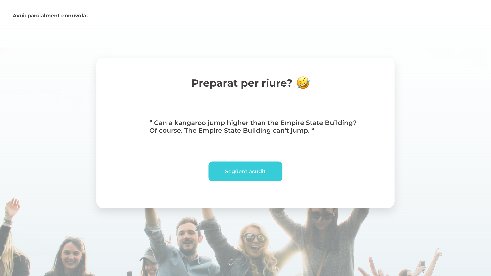

# S8. ACUDITS

## Descripció

Recordes la web d'acudits que vas crear en l'sprint 5? En aquesa entrega la passarem a React i afegirem diverses funcionalitats.

### Nivell 1

#### Exercici 1

Igual que vam fer amb javascript, crearem la base del projecte amb React, per a això seguirem els següents passos:

- Crearem la base del projecte sobre la qual treballar executant el comando:

**npx create-react-app **nom_del_projecte****

Més informació d'aquest pas: [**Link**](https://es.reactjs.org/docs/create-a-new-react-app.html)

- **Obrir el projecte** amb el Visual Studio Code

-  **Creació de component estàtic**: modificar el component principal perquè contingui el títol, espai per als acudits i el botó de següent (al entrar per primera vegada no se mostrarà cap acudit. Apareixerà el títol i el botó de següent acudit“).

- **Afegir interactivitat**: crear una funció que s'executi quan l'usuari premi el botó següent acudit. Aquesta funció haurà de carregar un acudit de la API i mostrar-lo a l'usuari.

Nota: En aquest exercici no és necessari maquetar la web, primer farem que funcioni per a passar a aplicar-li els estils.

---

### Nivell 2

#### Exercici 2

**Maquetar el projecte** perquè s'ajusti al següent disseny:

Nota: Tria la llibreria de la teva preferència.

---

### Nivell 3

#### Exercici 3

**Consumir una API d'informació meteorològica** i mostrar-ho en la web. Aquesta API ha de dir-se en l'obertura, no mitjançant un botó.

---

### Exercici 4

Modificar la navegació per a **mostrar a l'usuari una pantalla de benvinguda**. Hauràs de crear aquest nou component welcome i fer que es mostri per defecte. Aquest component haurà de tenir un botó d'accedir, que en ser premut s'accedeix a la pantalla d'acudits.
La pantalla de benvinguda i principal s'han de mostrar/ocultar fent ús del **renderitzat condicional.**

---

### - Exercici 5

Modificar l'exercici anterior per a **usar rutes** en lloc del renderitzat condicional.
Definir les rutes de l'aplicació i fer ús d'aquestes en aquest botó d'accedir.

---

## Recordatoris

 Els sprints duren dues setmanes i comencen en dilluns.

- **És obligatori pujar tots els lliuraments almenys amb el nivell 1** al final del sprint per a poder passar al següent.

- Els **lliuraments es faran a ser posible el dimecres o dijous de la segona setmana del sprint.** Si ho fas i avises al mentor perquè te de feedback, tindràs una oportunitat per a corregir errors i poder pujar nota!

- Com a més tard el lliurament es farà el dilluns següent, dia que comença el nou sprint.

- **És recomanable intentar aconseguir les màximes estrelles possibles** en els exercicis. Si no et dóna temps, no et preocupis. És una manera de millorar el teu perfil de cara al procés d'ocupabilitat, però també es té en compte el feedback dels mentors).
